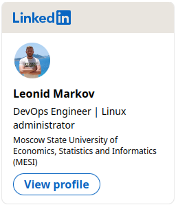

## Hi, I'm a beginner DevOps Engineer  

**Qualifications:**  
- University degree in Computer Science;  
- 1 + years of work experience as a DevOps Engineer;  
- Experience with **Nginx, Docker, Ansible, Terraform, Vagrant, Jenkins**;   
- Familiar with monitoring solutions like **Prometheus + Grafana**;  
- Skills in source code management tools **Git**;
- **Linux** administration;  
- Proficiency in writing scripts in **Bash**;
- Virtualization software **KVM, VirtualBox**, virtualization management platform - **Proxmox**
- Awareness of **TCP/IP** protocol stack
- Experience on a popular **web languages and framework**:  

- Knowledge of **Web sites**/services creation and management (experience with **CMS Bitrix**)

## Knowledge in programming  
  

## GitHub stats

---
### Contact Me:

